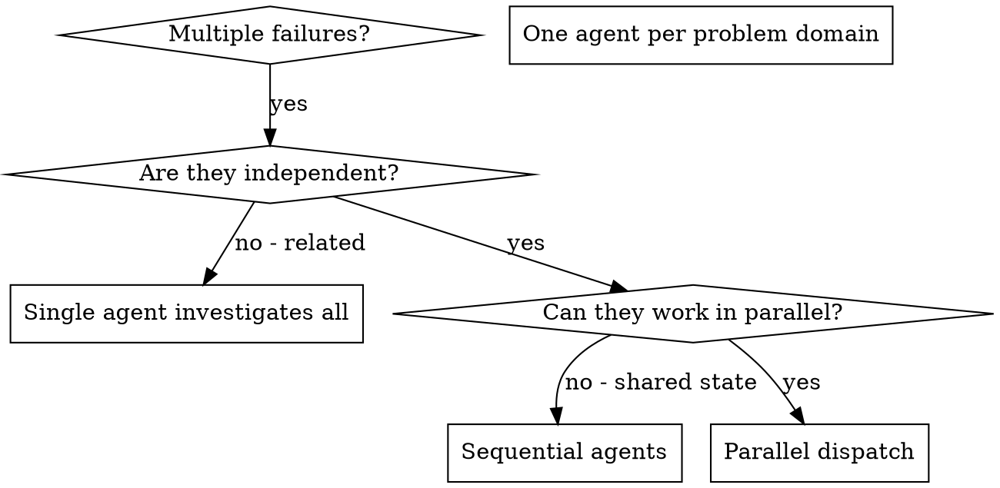

# Dispatching Parallel Agents

## Overview

When you have multiple unrelated failures (different test files, different subsystems, different bugs), investigating them sequentially wastes time. Each investigation is independent and can happen in parallel.

**Core principle:** Dispatch one agent per independent problem domain using the local `dispatch-harness`. Let them work concurrently in the background.

## When to Use



**Use when:**
- 3+ test files failing with different root causes
- Multiple subsystems broken independently
- Each problem can be understood without context from others
- No shared state between investigations

## Dispatch Harness Integration

To execute tasks in parallel, use the `run_shell_command` tool with `is_background: true` for each task.

**Command Template:**
`dispatch run --worker gemini --task-id <id> --workdir . "<prompt>"`

**Example:**
```bash
# Task 1
dispatch run --worker gemini --task-id fix-abort --workdir . "Fix agent-tool-abort.test.ts failures..."
# Task 2
dispatch run --worker gemini --task-id fix-batch --workdir . "Fix batch-completion-behavior.test.ts failures..."
```

## The Pattern

### 1. Identify Independent Domains

Group failures by what's broken:
- File A tests: Tool approval flow
- File B tests: Batch completion behavior
- File C tests: Abort functionality

Each domain is independent - fixing tool approval doesn't affect abort tests.

### 2. Create Focused Agent Tasks

Each task gets:
- **Specific scope:** One test file or subsystem
- **Clear goal:** Make these tests pass
- **Constraints:** Don't change other code
- **Expected output:** Summary of what you found and fixed

### 3. Dispatch in Parallel

Execute multiple `dispatch run` commands in the background. Note the `task-id` for each to track their logs and sentinel files.

### 4. Review and Integrate

When the background processes complete:
- Read each summary from the log files
- Verify fixes don't conflict
- Run full test suite
- Integrate all changes

## Agent Prompt Structure

Good agent prompts are:
1. **Focused** - One clear problem domain
2. **Self-contained** - All context needed to understand the problem
3. **Specific about output** - What should the agent return?

```markdown
Fix the 3 failing tests in src/agents/agent-tool-abort.test.ts:

1. "should abort tool with partial output capture" - expects 'interrupted at' in message
2. "should handle mixed completed and aborted tools" - fast tool aborted instead of completed
3. "should properly track pendingToolCount" - expects 3 results but gets 0

Return: Summary of what you found and what you fixed.
```

## Verification

After workers return:
1. **Review each summary** - Understand what changed
2. **Check for conflicts** - Did agents edit same code?
3. **Run full suite** - Verify all fixes work together
4. **Spot check** - Workers can make systematic errors

## Key Benefits

1. **Parallelization** - Multiple investigations happen simultaneously
2. **Focus** - Each worker has narrow scope, less context to track
3. **Independence** - Workers don't interfere with each other
4. **Speed** - 3 problems solved in time of 1
