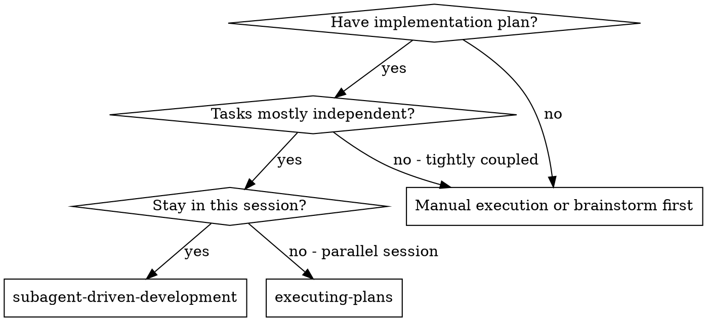
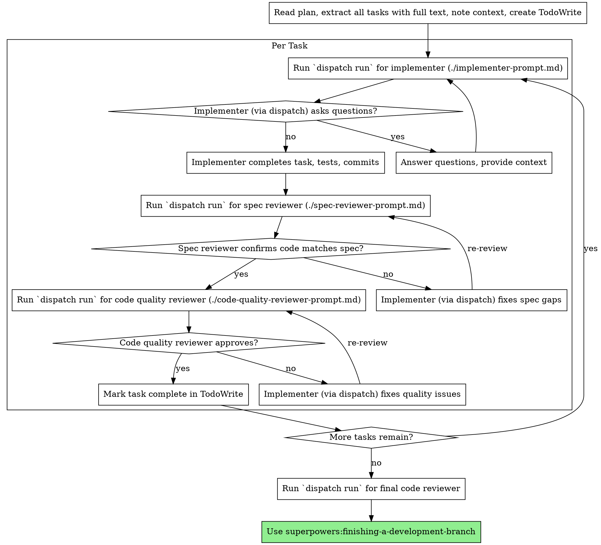

# Subagent-Driven Development

Execute plan by dispatching tasks to the local `dispatch-harness`, with two-stage review after each: spec compliance review first, then code quality review.

**Core principle:** Fresh isolated task (via dispatch) + two-stage review (spec then quality) = high quality, fast iteration

## When to Use



**vs. Executing Plans (parallel session):**
- Same session (no context switch)
- Fresh isolated session per task (no context pollution)
- Two-stage review after each task: spec compliance first, then code quality
- Faster iteration (no human-in-loop between tasks)

## The Process



## Dispatch Harness Integration

This skill uses the local `dispatch-harness` to execute tasks in isolated background sessions.

**To run a task:**
Use the `run_shell_command` tool to execute:
`dispatch run --worker gemini --task-id <id> --workdir . "<prompt>"`

The `<prompt>` should combine the role's template (e.g., `./implementer-prompt.md`) with the specific task text from the plan.

## Prompt Templates

These templates should be read and included in the dispatch prompt:
- `./implementer-prompt.md` - Role: Implementer
- `./spec-reviewer-prompt.md` - Role: Spec Compliance Reviewer
- `./code-quality-reviewer-prompt.md` - Role: Code Quality Reviewer

## Example Workflow

```
You: I'm using Subagent-Driven Development to execute this plan.

[Read plan file once: docs/plans/feature-plan.md]
[Extract all tasks and create TodoWrite]

Task 1: Hook installation script

[Read ./implementer-prompt.md]
[Run shell command: dispatch run --worker gemini --task-id 1 --workdir . "Role: [implementer-prompt] \n Task: Hook installation script..."]

Implementer (via dispatch): "Done. Implemented, tested, and committed."

[Read ./spec-reviewer-prompt.md]
[Run shell command: dispatch run --worker gemini --task-id 1-spec --workdir . "Role: [spec-reviewer-prompt] \n Task: Review Hook installation script..."]

Spec reviewer: ✅ Spec compliant.

... [Continue for code quality review and next tasks]
```

## Advantages

**vs. Manual execution:**
- Dispatch sessions follow TDD naturally
- Fresh context per task (no confusion)
- Parallel-safe (isolated workdirs)
- Worker can ask questions (before AND during work)

**Quality gates:**
- Two-stage review: spec compliance, then code quality
- Review loops ensure fixes actually work
- Spec compliance prevents over/under-building
- Code quality ensures implementation is well-built

## Red Flags

**Never:**
- Start implementation on main/master branch without explicit user consent
- Skip reviews (spec compliance OR code quality)
- Proceed with unfixed issues
- Accept "close enough" on spec compliance (spec reviewer found issues = not done)
- Move to next task while either review has open issues

**If reviewer finds issues:**
- Implementer (via dispatch) fixes them
- Reviewer reviews again
- Repeat until approved
- Don't skip the re-review

## Integration

**Required workflow skills:**
- **superpowers:using-git-worktrees** - REQUIRED: Set up isolated workspace before starting
- **superpowers:writing-plans** - Creates the plan this skill executes
- **superpowers:requesting-code-review** - Code review template for reviewer workers
- **superpowers:finishing-a-development-branch** - Complete development after all tasks

**Workers should use:**
- **superpowers:test-driven-development** - Workers follow TDD for each task
